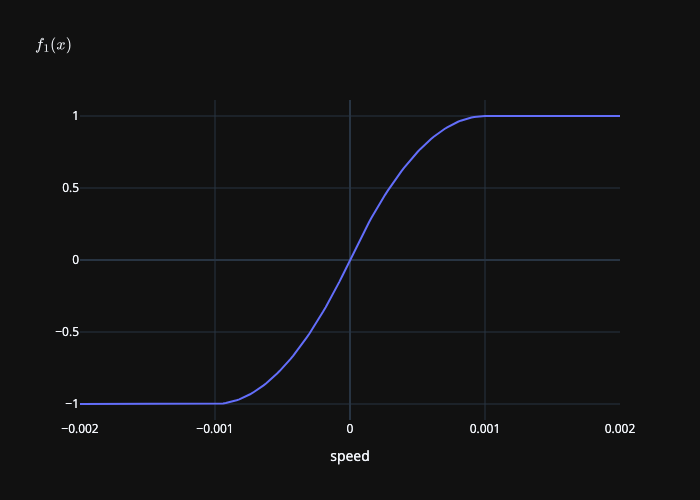

Advanced Friction
=================

This tutorial covers some advanced features of friction in the IPC Toolkit, including
spatially varying coefficients of friction and separate coefficients of friction for static and kinetic (dynamic) friction.

.. seealso::

    For an introduction to friction modeling and the dissipative potential, see
    `"Getting Started" <getting_started.html#friction>`_.

Spatially Varying Coefficients of Friction
------------------------------------------

.. warning::
    :title: Deprecated

    Spatially varying coefficient of friction is achieved by assigning coefficients to each vertex in the mesh. However, friction coefficients are not a material property and should instead be assigned to the contact pair. This feature will be replaced with a per-pair friction coefficient in a future release.

You can specify spatially varying coefficients of friction by passing an ``Eigen::VectorXd`` to ``TangentialCollisions::build``. Each entry in the vector corresponds to the coefficient of friction for a specific vertex in the mesh. This allows you to assign different friction coefficients to different parts of the mesh, enabling more realistic simulations of complex materials and surfaces.

You can also provide an optional ``blend_mu`` parameter to blend the coefficient of friction on either side of the contact. The default behavior is to average the coefficients of friction on both sides, but you can specify a custom blending function if needed (e.g., multiplying them or taking the maximum or minimum).

Separate Coefficients for Static and Kinetic Friction
-----------------------------------------------------

.. tip::
    :title: Experimental Feature

    The support for separate static and kinetic friction coefficients is an experimental feature introduced in v1.4.0. The behavior may be improved in future releases.

Traditionally, friction is modeled with a single coefficient. However, physical systems often exhibit different resistance to motion when at rest (static friction) versus when sliding (kinetic friction). The IPC Toolkit supports specifying both:

- **Static friction coefficient** (``mu_s``): Governs the maximum force resisting the initiation of motion.
- **Kinetic friction coefficient** (``mu_k``): Governs the force resisting ongoing motion.

Usage
~~~~~

To use separate static and kinetic friction coefficients, you can pass them as parameters when building the tangential collisions:

.. md-tab-set::

    .. md-tab-item:: C++

        .. code-block:: c++

            ipc::TangentialCollisions tangential_collisions;
            tangential_collisions.build(
                collision_mesh, vertices, collisions, B, barrier_stiffness,
                mu_s, mu_k);

    .. md-tab-item:: Python

        .. code-block:: python

            tangential_collisions = ipctk.TangentialCollisions()
            tangential_collisions.build(
                collision_mesh, vertices, collisions, B, barrier_stiffness,
                mu_s, mu_k)

How It Works
~~~~~~~~~~~~

Background
^^^^^^^^^^

IPC defines the local friction force as

.. math::
   F = -\mu \lambda \mathbf{T}(x) f_1(\|\mathbf{u}\|) \frac{\mathbf{u}}{\|\mathbf{u}\|},

where :math:`\lambda` is the contact force magnitude, :math:`T(x) \in \mathbb{R}^{3 n \times 2}` is the oriented sliding basis, and :math:`\mu` is the local friction coefficient. The function :math:`f_1` is a mollifier that smooths the transition between static and kinetic friction defined as

.. math::
   f_1(y)= \begin{cases}
        -\frac{y^2}{\epsilon_v^2}+\frac{2 y}{\epsilon_v} & \text{for}\: 0 \leq y \leq \epsilon_v \\
        1 & \text{otherwise}
    \end{cases}

where :math:`\epsilon_v` is a small constant (e.g., ``0.001``). The following plot show the behavior of the function :math:`f_1`:

   Smooth mollifier :math:`f_1(\|\mathbf{u}\|)` where :math:`\epsilon_v = 0.001`.

To create a dissipative potential we integrate :math:`f_1` to obtain a smooth mollifier :math:`f_0`:

.. math::
    f_0(y)= \begin{cases}
        \frac{\epsilon_{v}}{3} + \frac{y^{2}}{\epsilon_{v}} - \frac{y^{3}}{3 \epsilon_{v}^{2}} & \text{for}\: 0 \leq y \leq \epsilon_{v} \\
        y & \text{otherwise} \\
    \end{cases}

The following plot show the behavior of the function :math:`f_0`:

.. figure:: /_static/img/f0.png
   :align: center

   Integrated mollifier :math:`f_0(\|\mathbf{u}\|)` where :math:`\epsilon_v = 0.001`.

Smooth :math:`\mu`
^^^^^^^^^^^^^^^^^^

When adding separate coefficients for static and kinetic friction, we need to maintain the :math:`C^1` continuity of the friction force. This lead us to define a smooth coefficient of friction :math:`\mu(y)` that transitions between the static and kinetic coefficients based on the magnitude of the relative velocity :math:`y = \|\mathbf{u}\|`. The smooth coefficient of friction is defined as

.. math::
    \mu(y) = \begin{cases}
        2(\mu_{k} - \mu_{s})\frac{y^{2}}{\epsilon_{v}^{2}} + \mu_{s} & \text{for}\: y \leq \frac{\epsilon_{v}}{2} \\
        -2(\mu_{k} - \mu_{s})\frac{\left(\epsilon_{v} - y\right)^{2}}{\epsilon_{v}^{2}} + \mu_k & \text{for}\: y \leq \epsilon_{v} \\
        \mu_{k} & \text{for}\: y > \epsilon_{v}
    \end{cases}

We plot the smooth coefficient of friction :math:`\mu(y)` below:

.. figure:: /_static/img/mu.png
   :align: center

   Smooth coefficient of friction :math:`\mu(\|\mathbf{u}\|)` where :math:`\mu_s = 1`, :math:`\mu_k = 0.1`, and :math:`\epsilon_v = 0.001`.

Smooth :math:`\mu` Mollifier
^^^^^^^^^^^^^^^^^^^^^^^^^^^^

Replacing the constant coefficient of friction :math:`\mu` with a smooth function :math:`\mu(\|\mathbf{u}\|)` allows us to smoothly transition between static and kinetic friction. The function :math:`\mu(\|\mathbf{u}\|) f_1(\|\mathbf{u}\|)` is plotted below:

.. figure:: /_static/img/mu_f1.png
   :align: center

   Smooth coefficient of friction multiplied by the friction mollifier :math:`\mu(\|\mathbf{u}\|) f_1(\|\mathbf{u}\|)` where :math:`\mu_s = 1`, :math:`\mu_k = 0.1`, and :math:`\epsilon_v = 0.001`.

However, :math:`\frac{\mathrm{d}}{\mathrm{d}y} \mu(y) f_0(y) \neq \mu(y) f_1(y)`, so we need to adjust the integrated mollifier by integrating the product of the smooth coefficient of friction and the mollifier:

.. math::
    \int \mu(y) f_1(y) \mathrm{d} y = \begin{cases} \frac{\frac{\epsilon_{v}^{5} \left(27 \mu_{k} - 11 \mu_{s}\right)}{48} + \epsilon_{v}^{3} \mu_{s} y^{2} - \frac{\epsilon_{v}^{2} \mu_{s} y^{3}}{3} + \epsilon_{v} y^{4} \left(\mu_{k} - \mu_{s}\right) + \frac{2 y^{5} \left(- \mu_{k} + \mu_{s}\right)}{5}}{\epsilon_{v}^{4}} & \text{for}\: y \leq \frac{\epsilon_{v}}{2} \\
    \frac{\epsilon_{v}^{5} \left(9 \mu_{k} - 4 \mu_{s}\right) + 15 \epsilon_{v}^{3} y^{2} \left(- \mu_{k} + 2 \mu_{s}\right) + 5 \epsilon_{v}^{2} y^{3} \left(9 \mu_{k} - 10 \mu_{s}\right) - 30 \epsilon_{v} y^{4} \left(\mu_{k} - \mu_{s}\right) + 6 y^{5} \left(\mu_{k} - \mu_{s}\right)}{15 \epsilon_{v}^{4}} & \text{for}\: y \leq \epsilon_{v} \\
    \mu_{k} y & \text{for}\: y > \epsilon_v \end{cases}

The following plot shows the behavior of the integrated mollifier multiplied by the smooth coefficient of friction:

.. figure:: /_static/img/int_mu_f1_dx.png
   :align: center

   Integrated mollifier :math:`\int \mu(y) f_1(y) \mathrm{d} y` where :math:`\mu_s = 1`, :math:`\mu_k = 0.1`, and :math:`\epsilon_v = 0.001`.

Discussion
^^^^^^^^^^

While this approach provides a smooth transition between static and kinetic friction, there are some considerations:

1. The product :math:`\mu(y) f_1(y)` underestimates the friction force in the static regime, which may lead to less accurate simulations of static friction.
    - This is, when :math:`\mu_k < \mu_s` and :math:`|y| \leq \epsilon_v`, :math:`\max(\mu(y) f_1(y)) < \mu_s`.
    - We could address this by scaling by :math:`\frac{\max(\mu(y) f_1(y))}{\mu_s}`, but computing the maximum is non-trivial.
2. The combined function :math:`\mu(y) f_1(y)` is a degree 4 polynomial, which is more complex than the original mollifier :math:`f_1(y)` (degree 2). This may lead to more difficult to optimize problems.
    - We could replace :math:`\mu(y) f_1(y)` with a piecewise quadratic function that has the desired behavior. This help with (1) as well. However making it backwards compatible with the original mollifier is challenging.

If you have suggestions for improving this approach or alternative methods, please reach out on our `GitHub Discussions <https://github.com/ipc-sim/ipc-toolkit/discussions>`_.

Anisotropic Friction
--------------------

.. tip::
    :title: New Feature

    Anisotropic friction support was introduced to allow direction-dependent
    friction coefficients. This enables modeling materials with different
    friction properties along different directions (e.g., wood grain, brushed
    surfaces).

Anisotropic friction allows you to specify different friction coefficients
along different directions in the tangent plane. This is useful for modeling
materials that exhibit direction-dependent friction behavior, such as wood
(with different friction along vs. across the grain) or brushed metal surfaces.

The IPC Toolkit implements anisotropic friction using an elliptical L2
projection model. For a given tangential velocity direction :math:`\mathbf{t} =
\boldsymbol{\tau} / \|\boldsymbol{\tau}\|`, the effective friction coefficient
is computed as:

.. math::
   \mu_{\text{eff}} = \sqrt{(\mu_0 t_0)^2 + (\mu_1 t_1)^2}

where :math:`\mu_0` and :math:`\mu_1` are the friction coefficients along the
two tangent basis directions, and :math:`t_0` and :math:`t_1` are the
components of the unit direction vector.

Usage
~~~~~

To use anisotropic friction, you can assign anisotropic friction coefficients
to each tangential collision after building the collisions:

.. md-tab-set::

    .. md-tab-item:: C++

        .. code-block:: c++

            ipc::TangentialCollisions tangential_collisions;
            tangential_collisions.build(
                collision_mesh, vertices, collisions, B, barrier_stiffness,
                mu_s, mu_k);

            // Assign anisotropic friction coefficients per collision
            for (size_t i = 0; i < tangential_collisions.size(); ++i) {
                // Higher friction in first tangent direction, lower in second
                tangential_collisions[i].mu_s_aniso = Eigen::Vector2d(0.8, 0.4);
                tangential_collisions[i].mu_k_aniso = Eigen::Vector2d(0.6, 0.3);
            }

    .. md-tab-item:: Python

        .. code-block:: python

            tangential_collisions = ipctk.TangentialCollisions()
            tangential_collisions.build(
                collision_mesh, vertices, collisions, B, barrier_stiffness,
                mu_s, mu_k)

            # Assign anisotropic friction coefficients per collision
            for i in range(tangential_collisions.size()):
                # Higher friction in first tangent direction, lower in second
                tangential_collisions[i].mu_s_aniso = np.array([0.8, 0.4])
                tangential_collisions[i].mu_k_aniso = np.array([0.6, 0.3])

Relationship with Other Anisotropy Mechanisms
~~~~~~~~~~~~~~~~~~~~~~~~~~~~~~~~~~~~~~~~~~~~~

The IPC Toolkit supports two different anisotropy mechanisms:

1. **Velocity scaling** (``mu_aniso``): Scales the tangential velocity vector
   component-wise before computing friction. This affects the effective
   velocity magnitude used in friction calculations.

2. **Direction-dependent coefficients** (``mu_s_aniso``, ``mu_k_aniso``):
   Specifies different friction coefficients along different tangent
   directions. This affects the effective friction coefficient based on the
   direction of motion.

These two mechanisms can be used independently or together. When both are
enabled, the velocity scaling is applied first, then the direction-dependent
coefficients are computed based on the scaled velocity direction.

Future Directions
-----------------

The IPC Toolkit is continuously evolving, and future releases may include:

- Velocity-dependent friction models that adjust friction coefficients based
  on relative velocity magnitude.
- Rolling coefficients of friction for scenarios involving rolling contacts.

We encourage community contributions to expand these advanced friction
models. Feel free to submit pull requests with your improvements or open a
discussion on GitHub to propose new features.